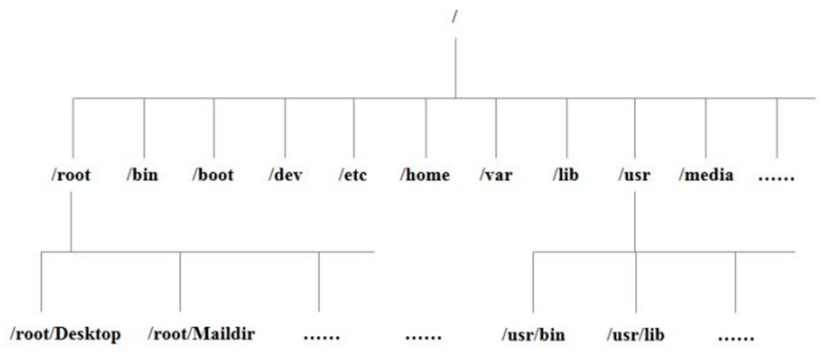
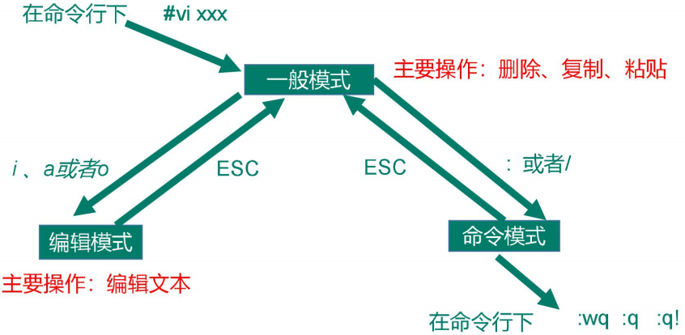

# Linux

## 一、Linux入门

### 1.1 概述

### 1.2 Linux和Windows区别

### 1.3 CentOS下载地址

## 二、VM与Linux的安装

### 2.1 VMWare安装


### 2.2 CentOS安装


## 三、Linux文件与目录结构

### 3.1 Linux文件

Linux 系统中一切皆文件。 

### 3.2 Linux目录结构



```cmd
[root@localhost /]# tree -L 2
.
├── bin -> usr/bin  #是Binary的缩写,这个目录存放着最经常使用的命令
├── boot  # 这里存放的是启动Linux时使用的一些核心文件，包括一些连接文件以及镜像文件，自己的安装别放这里。
├── dev  # 类似于windows的设备管理器，把所有的硬件用文件的形式存储。
├── etc  # 所有的系统管理所需要的配置文件和子目录。
├── home
│   └── huangyb  #存放普通用户的主目录，在Linux中每个用户都有一个自己的目录, 一般该目录名是以用户的账号命名的。
├── lib -> usr/lib  # 系统开机所需要最基本的动态连接共享库，其作用类似于Windows里的DLL文件。几乎所有的应用程序都需要用到这些共享库。
├── lib64 -> usr/lib64
├── media # linux系统会自动识别一些设备，例如U盘、光驱等等,当识别后,linux会把识别的设备挂载到这个目录下。CentOS7迁移到/run/media
├── mnt  #系统提供该目录是为了让用户临时挂载别的文件系统的,我们可以将外部的存储挂载在/mnt/上，然后进入该目录就可以查看里的内容了。
├── opt  # 这是给主机额外安装软件所摆放的目录。比如你安装一个mysql数据库则就可以放到这个目录下。默认是空的。
├── proc  # 这个目录是一个虚拟的目录，它是系统内存的映射，我们可以通过直接访问这个目录来获取系统信息。
├── root  # 该目录为系统管理员，也称作超级权限者的用户主目录。
├── run
├── sbin -> usr/sbin  # s就是Super User的意思，这里存放的是系统管理员使用的系统管理程序。
├── srv  # service缩写，该目录存放一些服务启动之后需要提取的数据。
├── sys  # 这是linux2.6内核的一个很大的变化。该目录下安装了2.6内核中新出现的一个文件系统sysfs。
├── tmp  # 这个目录是用来存放一些临时文件的。
├── usr  # Unix System Resource，这是一个非常重要的目录，用户的很多应用程序和文件都放在这个目录下，类似于windows下的program files目录。
│   ├── bin
│   ├── etc
│   ├── games
│   ├── include
│   ├── lib
│   ├── lib64
│   ├── libexec
│   ├── local
│   ├── sbin
│   ├── share
│   ├── src
│   └── tmp -> ../var/tmp
└── var # 这个目录中存放着在不断扩充着的东西，我们习惯将那些经常被修改的目录放在这个目录下。包括各种日志文件。
```


## 四、VI/VIM编辑器

### 4.1介绍

VI 是 Unix 操作系统和类 Unix 操作系统中最通用的文本编辑器。 

VIM 编辑器是从 VI 发展出来的一个性能更强大的文本编辑器。可以主动的以字体颜 色辨别语法的正确性，方便程序设计。VIM 与 VI 编辑器完全兼容。

### 4.2一般模式

以 vi 打开一个档案就直接进入一般模式了（这是默认的模式）。在这个模式中， 你可以使用『上下左右』按键来移动光标，你可以使用『删除字符』或『删除整行』来处理档案内容， 也可以使用『复制、粘贴』来处理你的文件数据。

| 语法                      | 功能描述                       |
| ------------------------- | ------------------------------ |
| yy                        | 复制光标当前一行               |
| y 数字 y （也可以数字yy） | 复制一段（从第几行到第几行）   |
| p                         | 箭头移动到目的行粘贴           |
| u                         | 撤销上一步                     |
| dd                        | 删除光标当前行                 |
| d 数字 d                  | 删除光标（含）后多少行         |
| x                         | 剪切一个字母，相当于 del       |
| X                         | 剪切一个字母，相当于 Backspace |
| yw                        | 复制一个词                     |
| dw                        | 删除一个词                     |
| shift+6（^）              | 移动到行头                     |
| shift+4 （$）             | 移动到行尾                     |
| 1+shift+g（或者gg）       | 移动到页头，数字               |
| shift+g                   | 移动到页尾                     |
| 数字+shift+g              | 移动到目标行                   |
| r                         | 替换当前字符                   |
| R                         | 替换一串字符，替换模式         |

:set nu（显示行号）

:set nonu（不显示行号）

### 4.3编辑模式

在一般模式中可以进行删除、复制、粘贴等的动作，但是却无法编辑文件内容的！要 等到你按下『i, I, o, O, a, A』等任何一个字母之后才会进入编辑模式。 

注意了！通常在Linux中，按下这些按键时，在画面的左下方会出现『INSERT或 REPLACE』的字样，此时才可以进行编辑。而如果要回到一般模式时， 则必须要按下 『Esc』这个按键即可退出编辑模式。

(1) 进入编辑模式

| 按键 | 功能               |
| ---- | ------------------ |
| i    | 当前光标前         |
| a    | 当前光标后         |
| o    | 当前光标行的下一行 |
| I    | 光标所在行最前     |
| A    | 光标所在行最后     |
| O    | 当前光标行的上一行 |

(2) 退出编辑模式

按『Esc』键 退出编辑模式，之后所在的模式为一般模式。

### 4.4指令模式

在一般模式当中，输入『 : / ?』3个中的任何一个按钮，就可以将光标移动到最底下那 一行。

在这个模式当中， 可以提供你『搜寻资料』的动作，而读取、存盘、大量取代字符、 离开 vi 、显示行号等动作是在此模式中达成的！

| 命令          | 功能                                        |
| ------------- | ------------------------------------------- |
| :w            | 保存                                        |
| :q            | 退出                                        |
| :!            | 强制执行                                    |
| /要查找的词   | n 查找下一个，N 往上查找                    |
| :noh          | 取消高亮显示                                |
| :set nu       | 显示行号                                    |
| :set nonu     | 关闭行号                                    |
| :s/old/new    | 替换当前行第一个old为new                    |
| :s/old/new/g  | 替换当前行所有old为new                      |
| :%s/old/new   | 替换每一行行第一个old为new                  |
| :%s/old/new/g | substitute,替换内容 /g 替换匹配到的所有内容 |

> 强制保存退出 :wq!

### 4.5模式间转换



## 五、网络配置

### 5.1 查看网络IP和网关

> VMware：编辑-》虚拟网络编辑器-》NAT设置

> Windows：控制面板-》网络和 Internet-》网络连接-》VMnet8-》详细信息

### 5.2 配置网络ip地址

#### 5.2.1 ifconfig配置网络接口

> Windows: ipconfig
>
> Linux: ifconfig   # network interfaces configuring 网络接口配置 显示所有网络接口的配置信息

#### 5.2.2 ping测试主机之间网络连通性

> ping 目的主机  （功能描述：测试当前服务器是否可以连接目的主机）

#### 5.2.3 修改IP地址

命令

```bash
vim /etc/sysconfig/network-scripts/ifcfg-ens33
```

内容

```
TYPE="Ethernet" #网络类型（通常是 Ethemet） 
PROXY_METHOD="none" 
BROWSER_ONLY="no" 
BOOTPROTO="static" #IP 的配置方法[none|static|bootp|dhcp]（引导 时不 使用协议|静态分配 IP|BOOTP 协议|DHCP 协议） DEFROUTE="yes" 
IPV4_FAILURE_FATAL="no" 
IPV6INIT="yes" 
IPV6_AUTOCONF="yes" 
IPV6_DEFROUTE="yes" 
IPV6_FAILURE_FATAL="no" 
IPV6_ADDR_GEN_MODE="stable-privacy" 
NAME="ens33" 
UUID="e83804c1-3257-4584-81bb-660665ac22f6" #随机 id 
DEVICE="ens33" #接口名（设备,网卡） 
ONBOOT="yes" #系统启动的时候网络接口是否有效（yes/no） 
#IP 地址 
IPADDR=192.168.1.100 
#网关 
GATEWAY=192.168.1.2 
#域名解析器 
DNS1=192.168.1.2
```

重启网络

```bash
service network restart 
```

#### 5.2.4 问题

（1）物理机能 ping 通虚拟机，但是虚拟机ping不通物理机，一般都是因为物理机的防火墙问题，把防火墙关闭就行 

（2）虚拟机能 Ping 通物理机，但是虚拟机 Ping 不通外网，一般都是因为 DNS 的设置有问题

（3）虚拟机Ping www.baidu.com显示域名未知等信息，一般查看 GATEWAY 和 DNS 设置是否正确 

（4）如果以上全部设置完还是不行，需要关闭 NetworkManager服务 

- systemctl stop NetworkManager 关闭 
- systemctl disable NetworkManager 禁用 

（5）如果检查发现systemctl status network有问题需要检查 ifcfg-ens33

### 5.3 配置主机名

#### 5.3.1 配置主机名称

（1）查看当前服务器主机名称

> hostname （功能描述：查看当前服务器的主机名称）

（2）如果感觉此主机名不合适，可以进行修改。通过编辑/etc/hostname 文件 

> vi /etc/hostname

修改完成后重启生效

（3）也可以用hostnamectl修改

> hostnamectl set-hostname 名字

#### 5.3.2 修改hosts映射文件

（1）修改 linux 的主机映射文件（hosts 文件） 

后续在 hadoop 阶段，虚拟机会比较多，配置时通常会采用主机名的方式配置，比较简单方便。不用刻意记 ip 地址。

- 打开/etc/hosts

  - ```bash
    vim /etc/hosts
    ```

  - ```bash
    192.168.2.100 hadoop100 
    192.168.2.101 hadoop101 
    192.168.2.102 hadoop102 
    ```

- 重启设备，重启后，查看主机名，已经修改成功

（2）修改 windows 的主机映射文件（hosts文件）

- 进入 C:\Windows\System32\drivers\etc 路径 

- 打开 hosts 文件并添加如下内容

  - ```bash
    192.168.2.100 hadoop100 
    192.168.2.101 hadoop101 
    192.168.2.102 hadoop102
    ```

### 5.4 远程登录

通常在工作过程中，公司中使用的真实服务器或者是云服务器，都不允许除运维人员之外的员工直接接触，因此就需要通过远程登录的方式来操作。所以，远程登录工具就是必不可缺的，目前，比较主流的有 Xshell, SSH Secure Shell, SecureCRT,FinalShell 等

## 六、系统管理

### 6.1 Linux中的进程和服务

> 计算机中，一个正在执行的程序或命令，被叫做“进程”（process）。 
>
> 启动之后一只存在、常驻内存的进程，一般被称作“服务”（service）。

### 6.2 service服务管理（CentOS 6）

（1） 基本语法

service 服务名 start|stop|restart|status 

（2）经验技巧

查看服务的方法：/etc/init.d/服务名 ,发现只有两个服务保留在 service

### 6.3 chkconfig设置后台服务的自启配置（CentOS 6）

### 6.4 systemctl（CentOS 7）

### 6.5 systemctl设置后台服务的自启配置

### 6.6 系统运行级别

### 6.7 关闭防火墙

### 6.8 关机重启命令

## 七、常用基本命令

### 7.1 帮助命令

### 7.2 文件目录类

### 7.3 时间日期类

### 7.4 用户管理命令

### 7.5 用户组管理命令

### 7.6 文件权限类

### 7.7 搜索查找类

### 7.8 压缩和解压类

### 7.9 磁盘查看和分区类

### 7.10 进程管理类

### 7.11 crontab系统定时任务

## 八、软件包管理

### 8.1 RPM

### 8.2 YUM仓库配置

## 九、克隆虚拟机

### 9.1 克隆

### 9.2 开机修改系统相关配置

## 十、常见错误及解决方案

## 十一、企业真实面试题

