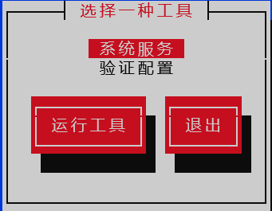
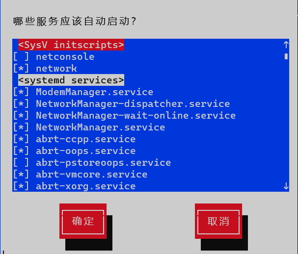
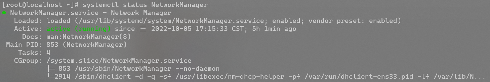

# Linux

## 一、Linux入门

### 1.1 概述

### 1.2 Linux和Windows区别

### 1.3 CentOS下载地址

## 二、VM与Linux的安装

### 2.1 VMWare安装


### 2.2 CentOS安装


ctrl+alt+F1，切换为图形化界面。ctrl+alt+F2，F3，F4...为命令行界面

## 三、Linux文件与目录结构

### 3.1 Linux文件

Linux 系统中一切皆文件。 

### 3.2 Linux目录结构


```cmd
[root@localhost /]# tree -L 2
.
├── bin -> usr/bin  #是Binary的缩写,这个目录存放着最经常使用的命令
├── boot  # 这里存放的是启动Linux时使用的一些核心文件，包括一些连接文件以及镜像文件，自己的安装别放这里。
├── dev  # 类似于windows的设备管理器，把所有的硬件用文件的形式存储。
├── etc  # 所有的系统管理所需要的配置文件和子目录。
├── home
│   └── huangyb  #存放普通用户的主目录，在Linux中每个用户都有一个自己的目录, 一般该目录名是以用户的账号命名的。
├── lib -> usr/lib  # 系统开机所需要最基本的动态连接共享库，其作用类似于Windows里的DLL文件。几乎所有的应用程序都需要用到这些共享库。
├── lib64 -> usr/lib64
├── media # linux系统会自动识别一些设备，例如U盘、光驱等等,当识别后,linux会把识别的设备挂载到这个目录下。CentOS7迁移到/run/media
├── mnt  #系统提供该目录是为了让用户临时挂载别的文件系统的,我们可以将外部的存储挂载在/mnt/上，然后进入该目录就可以查看里的内容了。
├── opt  # 这是给主机额外安装软件所摆放的目录。比如你安装一个mysql数据库则就可以放到这个目录下。默认是空的。
├── proc  # 这个目录是一个虚拟的目录，它是系统内存的映射，我们可以通过直接访问这个目录来获取系统信息。
├── root  # 该目录为系统管理员，也称作超级权限者的用户主目录。
├── run
├── sbin -> usr/sbin  # s就是Super User的意思，这里存放的是系统管理员使用的系统管理程序。
├── srv  # service缩写，该目录存放一些服务启动之后需要提取的数据。
├── sys  # 这是linux2.6内核的一个很大的变化。该目录下安装了2.6内核中新出现的一个文件系统sysfs。
├── tmp  # 这个目录是用来存放一些临时文件的。
├── usr  # Unix System Resource，这是一个非常重要的目录，用户的很多应用程序和文件都放在这个目录下，类似于windows下的program files目录。
│   ├── bin
│   ├── etc
│   ├── games
│   ├── include
│   ├── lib
│   ├── lib64
│   ├── libexec
│   ├── local
│   ├── sbin
│   ├── share
│   ├── src
│   └── tmp -> ../var/tmp
└── var # 这个目录中存放着在不断扩充着的东西，我们习惯将那些经常被修改的目录放在这个目录下。包括各种日志文件。
```


## 四、VI/VIM编辑器

### 4.1介绍

VI 是 Unix 操作系统和类 Unix 操作系统中最通用的文本编辑器。 

VIM 编辑器是从 VI 发展出来的一个性能更强大的文本编辑器。可以主动的以字体颜 色辨别语法的正确性，方便程序设计。VIM 与 VI 编辑器完全兼容。

### 4.2一般模式

以 vi 打开一个档案就直接进入一般模式了（这是默认的模式）。在这个模式中， 你可以使用『上下左右』按键来移动光标，你可以使用『删除字符』或『删除整行』来处理档案内容， 也可以使用『复制、粘贴』来处理你的文件数据。

| 语法                      | 功能描述                       |
| ------------------------- | ------------------------------ |
| yy                        | 复制光标当前一行               |
| y 数字 y （也可以数字yy） | 复制一段（从第几行到第几行）   |
| p                         | 箭头移动到目的行粘贴           |
| u                         | 撤销上一步                     |
| dd                        | 删除光标当前行                 |
| d 数字 d                  | 删除光标（含）后多少行         |
| x                         | 剪切一个字母，相当于 del       |
| X                         | 剪切一个字母，相当于 Backspace |
| yw                        | 复制一个词                     |
| dw                        | 删除一个词                     |
| shift+6（^）              | 移动到行头                     |
| shift+4 （$）             | 移动到行尾                     |
| 1+shift+g（或者gg）       | 移动到页头，数字               |
| shift+g                   | 移动到页尾                     |
| 数字+shift+g              | 移动到目标行                   |
| r                         | 替换当前字符                   |
| R                         | 替换一串字符，替换模式         |

:set nu（显示行号）

:set nonu（不显示行号）

### 4.3编辑模式

在一般模式中可以进行删除、复制、粘贴等的动作，但是却无法编辑文件内容的！要 等到你按下『i, I, o, O, a, A』等任何一个字母之后才会进入编辑模式。 

注意了！通常在Linux中，按下这些按键时，在画面的左下方会出现『INSERT或 REPLACE』的字样，此时才可以进行编辑。而如果要回到一般模式时， 则必须要按下 『Esc』这个按键即可退出编辑模式。

(1) 进入编辑模式

| 按键 | 功能               |
| ---- | ------------------ |
| i    | 当前光标前         |
| a    | 当前光标后         |
| o    | 当前光标行的下一行 |
| I    | 光标所在行最前     |
| A    | 光标所在行最后     |
| O    | 当前光标行的上一行 |

(2) 退出编辑模式

按『Esc』键 退出编辑模式，之后所在的模式为一般模式。

### 4.4指令模式

在一般模式当中，输入『 : / ?』3个中的任何一个按钮，就可以将光标移动到最底下那 一行。

在这个模式当中， 可以提供你『搜寻资料』的动作，而读取、存盘、大量取代字符、 离开 vi 、显示行号等动作是在此模式中达成的！

| 命令          | 功能                                        |
| ------------- | ------------------------------------------- |
| :w            | 保存                                        |
| :q            | 退出                                        |
| :!            | 强制执行                                    |
| /要查找的词   | n 查找下一个，N 往上查找                    |
| :noh          | 取消高亮显示                                |
| :set nu       | 显示行号                                    |
| :set nonu     | 关闭行号                                    |
| :s/old/new    | 替换当前行第一个old为new                    |
| :s/old/new/g  | 替换当前行所有old为new                      |
| :%s/old/new   | 替换每一行行第一个old为new                  |
| :%s/old/new/g | substitute,替换内容 /g 替换匹配到的所有内容 |

> 强制保存退出 :wq!

### 4.5模式间转换


## 五、网络配置

### 5.1 查看网络IP和网关

> VMware：编辑-》虚拟网络编辑器-》NAT设置

> Windows：控制面板-》网络和 Internet-》网络连接-》VMnet8-》详细信息

### 5.2 配置网络ip地址

#### 5.2.1 ifconfig配置网络接口

> Windows: ipconfig
>
> Linux: ifconfig   # network interfaces configuring 网络接口配置 显示所有网络接口的配置信息

#### 5.2.2 ping测试主机之间网络连通性

> ping 目的主机  （功能描述：测试当前服务器是否可以连接目的主机）

#### 5.2.3 修改IP地址

命令

```bash
vim /etc/sysconfig/network-scripts/ifcfg-ens33
```

内容

```
TYPE="Ethernet" #网络类型（通常是 Ethemet） 
PROXY_METHOD="none" 
BROWSER_ONLY="no" 
BOOTPROTO="static" #IP 的配置方法[none|static|bootp|dhcp]（引导 时不 使用协议|静态分配 IP|BOOTP 协议|DHCP 协议） DEFROUTE="yes" 
IPV4_FAILURE_FATAL="no" 
IPV6INIT="yes" 
IPV6_AUTOCONF="yes" 
IPV6_DEFROUTE="yes" 
IPV6_FAILURE_FATAL="no" 
IPV6_ADDR_GEN_MODE="stable-privacy" 
NAME="ens33" 
UUID="e83804c1-3257-4584-81bb-660665ac22f6" #随机 id 
DEVICE="ens33" #接口名（设备,网卡） 
ONBOOT="yes" #系统启动的时候网络接口是否有效（yes/no） 
#IP 地址 
IPADDR=192.168.1.100 
#网关 
GATEWAY=192.168.1.2 
#域名解析器 
DNS1=192.168.1.2
```

重启网络

```bash
service network restart 
```

#### 5.2.4 问题

（1）物理机能 ping 通虚拟机，但是虚拟机ping不通物理机，一般都是因为物理机的防火墙问题，把防火墙关闭就行 

（2）虚拟机能 Ping 通物理机，但是虚拟机 Ping 不通外网，一般都是因为 DNS 的设置有问题

（3）虚拟机Ping www.baidu.com显示域名未知等信息，一般查看 GATEWAY 和 DNS 设置是否正确 

（4）如果以上全部设置完还是不行，需要关闭 NetworkManager服务（或者关闭network，一个centos6一个centos7）

- systemctl stop NetworkManager 关闭 
- systemctl disable NetworkManager 禁用 

（5）如果检查发现systemctl status network有问题需要检查 ifcfg-ens33

### 5.3 配置主机名

#### 5.3.1 配置主机名称

（1）查看当前服务器主机名称

> hostname （功能描述：查看当前服务器的主机名称）

```bash
[root@localhost /]# hostname
localhost.localdomain
```

（2）如果感觉此主机名不合适，可以进行修改。通过编辑/etc/hostname 文件 

> vim /etc/hostname

修改完成后重启生效

（3）也可以用hostnamectl修改

> hostnamectl set-hostname 名字

#### 5.3.2 修改hosts映射文件

（1）修改 linux 的主机映射文件（hosts 文件） 

后续在 hadoop 阶段，虚拟机会比较多，配置时通常会采用主机名的方式配置，比较简单方便。不用刻意记 ip 地址。

- 打开/etc/hosts

  - ```bash
    vim /etc/hosts
    ```

  - ```bash
    192.168.2.100 hadoop100 
    192.168.2.101 hadoop101 
    192.168.2.102 hadoop102 
    ```

- 重启设备，重启后，查看主机名，已经修改成功

（2）修改 windows 的主机映射文件（hosts文件）

- 进入 C:\Windows\System32\drivers\etc 路径 

- 打开 hosts 文件并添加如下内容

  - ```bash
    192.168.2.100 hadoop100 
    192.168.2.101 hadoop101 
    192.168.2.102 hadoop102
    ```

### 5.4 远程登录

通常在工作过程中，公司中使用的真实服务器或者是云服务器，都不允许除运维人员之外的员工直接接触，因此就需要通过远程登录的方式来操作。所以，远程登录工具就是必不可缺的，目前，比较主流的有 Xshell, SSH Secure Shell, SecureCRT,FinalShell 等

## 六、系统管理

### 6.1 Linux中的进程和服务

> 计算机中，一个正在执行的程序或命令，被叫做“进程”（process）。 
>
> 启动之后一只存在、常驻内存的进程，一般被称作“服务”（service）。
>
> 守护进程(daemon)是一类在后台运行的特殊进程，用于执行特定的系统任务。很多守护进程在系统引导的时候启动，并且一直运行直到系统关闭。另一些只在需要的时候才启动，完成任务后就自动结束。

### 6.2 service服务管理（CentOS 6）

（1） 基本语法

>  service 服务名 start|stop|restart|status 

（2）经验技巧

查看服务的方法：/etc/init.d/服务名 ,发现只有两个服务保留在 service

```bash
[root@localhost init.d]# pwd
/etc/init.d
[root@localhost init.d]# ls -al
总用量 40
drwxr-xr-x.  2 root root    70 9月   6 23:23 .
drwxr-xr-x. 10 root root   127 9月   6 23:23 ..
-rw-r--r--.  1 root root 18281 5月  22 2020 functions
-rwxr-xr-x.  1 root root  4569 5月  22 2020 netconsole
-rwxr-xr-x.  1 root root  7928 5月  22 2020 network
-rw-r--r--.  1 root root  1160 10月  2 2020 README
```

（3） 举例

```bash
#查看网络服务的状态 
service network status 
#停止网络服务 
service network stop 
#启动网络服务 
service network start 
#重启网络服务 
service network restart
```

### 6.3 chkconfig设置后台服务的自启配置（CentOS 6）

命令行输入setup，按tab键可以选择功能



选择系统服务，回车，前面的[]括号里面有*为开机自启动，可以按空格切换。SysV对应老版本init.d目录里两个启动脚本。



(1） 基本语法

chkconfig （功能描述：查看所有服务器自启配置） 

> chkconfig 服务名 off （功能描述：关掉指定服务的自动启动） 
>
> chkconfig 服务名 on （功能描述：开启指定服务的自动启动） 
>
> chkconfig 服务名 --list （功能描述：查看服务开机启动状态）

```bash
[root@localhost ~]# chkconfig --list

注：该输出结果只显示 SysV 服务，并不包含
原生 systemd 服务。SysV 配置数据
可能被原生 systemd 配置覆盖。

      要列出 systemd 服务，请执行 'systemctl list-unit-files'。
      查看在具体 target 启用的服务请执行
      'systemctl list-dependencies [target]'。

netconsole      0:关    1:关    2:关    3:关    4:关    5:关    6:关
network         0:关    1:关    2:开    3:开    4:开    5:开    6:关
```

(2） 举例实操

- 开启/关闭 network(网络)服务的自动启动 

> chkconfig network on 
> chkconfig network off 

- 开启/关闭 network 服务指定级别的自动启动 

> chkconfig --level 指定级别 network on 
> chkconfig --level 指定级别 network off

### 6.4 systemctl（CentOS 7）

（1） 基本语法

> systemctl start | stop | restart | status 服务名 

（2）经验技巧

查看服务的方法：/usr/lib/systemd/system

```bash
[root@localhost system]# pwd
/usr/lib/systemd/system
[root@localhost system]# ls -al
总用量 1544
-rw-r--r--.  1 root root   275 10月  2 2020 abrt-ccpp.service
-rw-r--r--.  1 root root   380 10月  2 2020 abrtd.service
-rw-r--r--.  1 root root   361 10月  2 2020 abrt-oops.service
-rw-r--r--.  1 root root   266 10月  2 2020 abrt-pstoreoops.service
...
```

（3） 举例实操

```bash
# 查看防火墙服务的状态 
systemctl status firewalld 
# 停止防火墙服务 
systemctl stop firewalld 
# 启动防火墙服务 
systemctl start firewalld 
# 重启防火墙服务 
systemctl restart firewalld
```



### 6.5 systemctl设置后台服务的自启配置

（1）基本语法

>  systemctl list-unit-files （功能描述：查看服务开机启动状态） 

> systemctl disable service_name （功能描述：关掉指定服务的自动启动） 

> systemctl enable service_name （功能描述：开启指定服务的自动启动） 

（2）举例

```bash
# 开启/关闭 防火墙(CentOS6防火墙为iptables，CentOS7为firewalld)服务的自动启动 
[root@localhost ~]# systemctl disable firewalld.service
[root@localhost ~]# systemctl enable firewalld.service
```

### 6.6 系统运行级别

（1）Linux系统的运行级别runlevel (CentOS6)


查看默认级别：vim /etc/inittab

Linux系统有7种运行级别(runlevel)：**常用的是级别3和5**

- 运行级别0：系统停机状态，系统默认运行级别不能设为0，否则不能正常启动
- 运行级别1：单用户工作状态，root权限，用于系统维护，禁止远程登陆
- 运行级别2：多用户状态(没有NFS，网络文件系统),不支持网络
- 运行级别3：完全的多用户状态(有NFS)，登陆后进入控制台命令行模式
- 运行级别4：系统未使用，保留
- 运行级别5：X11控制台,登陆后进入图形GUI模式
- 运行级别6：系统正常关闭并重启，默认运行级别不能设为6，否则不能正常启动

（2）CentOS7的运行级别简化为

>  multi-user.target 等价于原运行级别 3（多用户有网，无图形界面） 

>  graphical.target 等价于原运行级别 5（多用户有网，有图形界面） 

（3） 查看当前运行级别

> systemctl get-default 

```bash
[root@localhost ~]# systemctl get-default
graphical.target
```

（4）修改当前运行级别

- ctrl+alt+F1，切换为图形化界面(级别5)。ctrl+alt+F2，F3，F4...为命令行界面（级别3）
- init+运行级别（例如init 3）
-  systemctl set-default TARGET.target （这里 TARGET 取 multi-user 或者 graphical）

### 6.7 关闭防火墙

```bash
# 开启/关闭 防火墙(CentOS6防火墙为iptables，CentOS7为firewalld)服务的自动启动 
[root@localhost ~]# systemctl status firewalld
● firewalld.service - firewalld - dynamic firewall daemon
   Loaded: loaded (/usr/lib/systemd/system/firewalld.service; enabled; vendor preset: enabled)
   Active: active (running) since 四 2022-10-06 19:54:44 CST; 2h 47min ago
   
[root@localhost ~]# systemctl stop firewalld
[root@localhost ~]# systemctl status firewalld
● firewalld.service - firewalld - dynamic firewall daemon
   Loaded: loaded (/usr/lib/systemd/system/firewalld.service; enabled; vendor preset: enabled)
   Active: inactive (dead) since 四 2022-10-06 22:43:48 CST; 2s ago
   
[root@localhost ~]# systemctl disable firewalld
Removed symlink /etc/systemd/system/multi-user.target.wants/firewalld.service.
Removed symlink /etc/systemd/system/dbus-org.fedoraproject.FirewallD1.service.
[root@localhost ~]# systemctl status firewalld.service
● firewalld.service - firewalld - dynamic firewall daemon
   Loaded: loaded (/usr/lib/systemd/system/firewalld.service; disabled; vendor preset: enabled)
   Active: inactive (dead)
   
[root@localhost ~]# systemctl enable firewalld.service
[root@localhost ~]# systemctl start firewalld.service

#注：firewalld后面加不加.service都一样
```

### 6.8 关机重启命令

在 linux 领域内大多用在服务器上，很少遇到关机的操作。毕竟服务器上跑一个服务是永无止境的，除非特殊情况下，不得已才会关机

（1）基本语法

- sync （功能描述：将数据由内存同步到硬盘中） 

- halt（功能描述：停机，关闭系统，但不断电） 

- poweroff（功能描述：关机，断电） 

- reboot（功能描述：就是重启，等同于 shutdown -r now） 

- shutdown [选项] 时间 

  - ```bash
    shutdown [OPTIONS...] [TIME] [WALL...]
    
    [OPTIONS...] 
         --help      Show this help   停机
      -H --halt      Halt the machine
      -P --poweroff  Power-off the machine
      -r --reboot    Reboot the machine  重启
      -h             Equivalent to --poweroff, overridden by --halt
      -k             Don't halt/power-off/reboot, just send warnings
         --no-wall   Don't send wall message before halt/power-off/reboot
      -c             Cancel a pending shutdown  取消关闭
      
    [TIME]
      now  立刻关机
      数字  几分钟后关机，单位：分钟
      时间  在这个时间定时关机
    ```

（2） 介绍

Linux系统中为了提高磁盘的读写效率，对磁盘采取了 “预读迟写”操作方式。当用户保存文件时，Linux 核心并不一定立即将保存数据写入物理磁盘中，而是将数据保存在缓冲区中，等缓冲区满时再写入磁盘，这种方式可以极大的提高磁盘写入数据的效率。但是，也带来了安全隐患，如果数据还未写入磁盘时，系统掉电或者其他严重问题出现，则将导致数据丢失。使用`sync`指令可以立即将缓冲区的数据写入磁盘。 

（3）举例

```bash
# 将数据由内存同步到硬盘中 
[root@localhost ~]# sync 
# 重启 
[root@localhost ~]# reboot 
# 停机（不断电） 
[root@localhost ~]# halt 
# 计算机将在 1 分钟后关机，并且会显示在登录用户的当前屏幕中 
[root@localhost ~]# shutdown -h 1 ‘This server will shutdown after 1 mins’ 
# 立马关机（等同于 poweroff） 
[root@localhost ~]# shutdown -h now
```

## 七、常用基本命令

Shell 可以看作是一个命令解释器，为我们提供了交互式的文本控制台界面。我们可以通过终端控制台来输入命令，由 shell 进行解释并最终交给内核执行。

> Unix => Bourne shell
>
> Linux => Bourne again shell  (bash)
>
> Debian -> Ubuntu => dash
>
> CSH: 是一种计算机中的Linux、Unix命令

### 7.1 帮助命令

#### 7.1.1 man获得帮助信息

manual：手册; 说明书; 指南;

（1）基本语法

> man [命令或配置文件] （功能描述：获得帮助信息） 

（2）显示说明

| 信息        | 功能                     |
| ----------- | ------------------------ |
| NAME        | 命令的名称和单行描述     |
| SYNOPSIS    | 怎样使用命令             |
| DESCRIPTION | 命令功能的深入讨论       |
| EXAMPLES    | 怎样使用命令的例子       |
| SEE ALSO    | 相关主题（通常是手册页） |

（3）举例

```bash
[root@localhost ~]# man ls

[root@localhost huangyb]# man -f cd 
cd (1)               - GNU Bourne-Again SHell (GNU 命令解释程序 “Bourne二世”)
cd (3tcl)            - 改变工作目录
cd (1p)              - change the working directory
[root@localhost huangyb]# man 1p cd 
[root@localhost huangyb]# man 3 cd

[root@localhost huangyb]# man man
```

#### 7.1.2 help获得shell内置命令的帮助信息

一部分基础功能的系统命令是直接内嵌在 shell 中的，系统加载启动之后会随着 shell 一起加载，常驻系统内存中。这部分命令被称为“内置（built-in）命令”；相应的其它命令被称为“外部命令”。

（1）基本语法 

>  help 命令（功能描述：获得 shell 内置命令的帮助信息） 
>
>  type命令  用来显示指定命令的类型，判断给出的指令是内部指令还是外部指令

（2）举例

```bash
# 查看 cd 命令的帮助信息,cd,exit命令是shell脚本的内置命令
[root@localhost ~]#  help cd

[root@localhost huangyb]# help ls
bash: help: 没有与 `ls' 匹配的帮助主题。尝试 `help help' 或者 `man -k ls' 或者 `info ls'。
[root@localhost huangyb]# ls --help

# type命令
[root@localhost huangyb]# type ls
ls 是 `ls --color=auto' 的别名
[root@localhost huangyb]# type cd
cd 是 shell 内嵌
[root@localhost huangyb]# type useradd
useradd 是 /usr/sbin/useradd
[root@localhost huangyb]# type history  # history命令显示之前输入的命令
history 是 shell 内嵌
[root@localhost huangyb]# type exit
exit 是 shell 内嵌
```

#### 7.1.3 常用快捷键

| 常用快捷键 | 功能                                  |
| ---------- | ------------------------------------- |
| CTRL+C     | 停止进程                              |
| CTRL+L     | 清屏，等同于 clear；彻底清屏是：reset |
| TAB键      | 提示                                  |
| 上下键     | 查找执行过的命令                      |


### 7.2 文件目录类

#### 7.2.1 pwd

pwd:print working directory 打印工作目录,显示当前工作目录的绝对路径

（1）基本语法 

> pwd ：显示当前工作目录的绝对路径

（2）举例

```bash
# 显示当前工作目录的绝对路径
[root@localhost ~]# pwd
/root
[root@localhost ~]# type pwd
pwd 是 shell 内嵌
```

#### 7.2.2 ls

ls:list 列出目录内容

（1）基本语法 

> ls [选项] [目录或是文件]

（2）选项说明

| 选项 | 功能                                                         |
| ---- | ------------------------------------------------------------ |
| -a   | 全部的文件，连同隐藏档( 开头为 . 的文件) 一起列出来(常用)    |
| -l   | 长数据串列出，包含文件的属性与权限等等数据；(常用)等价于"ll"命令 |

（3）显示说明

每行列出的信息依次是： 文件类型与权限 链接数 文件属所有者 文件属组 文件大小用byte来表示 建立或最近修改的时间 名字

（2）举例

```bash
[root@localhost ~]# ls
anaconda-ks.cfg  initial-setup-ks.cfg
[root@localhost ~]# type ls
ls 是 `ls --color=auto' 的别名
[root@localhost ~]# ls -a
.  ..  anaconda-ks.cfg  .bash_history  .bash_logout  .bash_profile  .bashrc  .cache  .config  .cshrc  .dbus  initial-setup-ks.cfg  .tcshrc  .viminfo  .xauthqJIw7m
[root@localhost ~]# ls -l
总用量 8
-rw-------. 1 root root 1583 9月   6 23:32 anaconda-ks.cfg
-rw-r--r--. 1 root root 1631 9月   6 23:33 initial-setup-ks.cfg
[root@localhost ~]# ls -al
总用量 40
dr-xr-x---.  5 root root  241 10月 30 18:34 .
dr-xr-xr-x. 17 root root  224 9月   6 23:31 ..
-rw-------.  1 root root 1583 9月   6 23:32 anaconda-ks.cfg
......
-rw-------.  1 root root  132 10月 30 18:34 .xauthqJIw7m
[root@localhost ~]# ll
总用量 8
-rw-------. 1 root root 1583 9月   6 23:32 anaconda-ks.cfg
-rw-r--r--. 1 root root 1631 9月   6 23:33 initial-setup-ks.cfg
[root@localhost ~]# type ll
ll 是 `ls -l --color=auto' 的别名

```


#### 7.2.3 cd

cd:Change Directory 切换路径

（1）基本语法 

> cd [参数]

（2）参数说明

| 参数        | 功能                                 |
| ----------- | ------------------------------------ |
| cd 绝对路径 | 切换路径                             |
| cd 相对路径 | 切换路径                             |
| cd ~或者 cd | 回到自己的家目录                     |
| cd -        | 回到上一次所在目录                   |
| cd ..       | 回到当前目录的上一级目录             |
| cd -P       | 跳转到实际物理路径，而非快捷方式路径 |

#### 7.2.4 mkdir

mkdir:Make directory 建立目录

（1）基本语法 

> mkdir [选项] 要创建的目录

（2）参数说明

| 选项 | 功能         |
| ---- | ------------ |
| -p   | 创建多层目录 |

（3）举例

```bash
# 创建一个目录
[root@localhost ~]# mkdir a
[root@localhost ~]# ls
a
[root@localhost ~]# mkdir a/b
[root@localhost ~]# ls a
b
[root@localhost ~]# mkdir c/d
mkdir: 无法创建目录"c/d": 没有那个文件或目录
[root@localhost ~]# mkdir c c/d
[root@localhost ~]# ls c
d
# 创建一个多级目录
[root@localhost ~]# mkdir -p d/e/f
[root@localhost ~]# ls d/e
f
```

#### 7.2.5 rmdir

rmdir:Remove directory 移除目录,删除一个空的目录

（1）基本语法 

> rmdir 要删除的空目录

（2）举例

```bash
[root@localhost ~]# rmdir c/d c 
或者
[root@localhost ~]# rmdir -p c/d     # d目录空删除d，然后c空继续删c
```

#### 7.2.6 touch

创建空文件

（1）基本语法 

> touch 文件名称

#### 7.2.7 cp

复制文件或目录

（1）基本语法 

> cp [选项] source dest （功能描述：复制source文件到dest。source:源文件,dest:目标文件）

（2）选项说明

| 选项 | 功能                                                         |
| ---- | ------------------------------------------------------------ |
| -r   | 递归复制整个文件夹                                           |
| -p   | 保持指定的属性(默认：模式,所有权,时间戳)，如果可能保持附加属性：环境、链接、xattr 等 |

（3）举例

```bash
[root@localhost ~]# cp initial.cfg /home/huangyb/
cp：是否覆盖"/home/huangyb/initial.cfg"？ y
[root@localhost ~]# \cp initial.cfg /home/huangyb/
# \为直接使用Linux的原生命令

[root@localhost ~]# type cp
cp 是 `cp -i' 的别名
#   -i, --interactive      prompt before overwrite (overrides a previous -n option) 提醒在重写前
# 如果不想被提醒，可以使用\cp原生命令

[root@localhost ~]# alias
alias cp='cp -i'
alias egrep='egrep --color=auto'
alias fgrep='fgrep --color=auto'
alias grep='grep --color=auto'
alias l.='ls -d .* --color=auto'
alias ll='ls -l --color=auto'
alias ls='ls --color=auto'
alias mv='mv -i'
alias rm='rm -i'
alias which='alias | /usr/bin/which --tty-only --read-alias --show-dot --show-tilde'

```


#### 7.2.8 rm

删除文件或目录

（1）基本语法 

> rm [选项] deleteFile （功能描述：递归删除目录中所有内容）

（2）选项说明

| 选项 | 功能                                   |
| ---- | -------------------------------------- |
| -r   | 递归删除目录中所有内容                 |
| -f   | 强制执行删除操作，而不提示用于进行确认 |
| -v   | 显示指令的详细执行过程                 |

#### 7.2.9 mv

移动文件与目录或重命名

（1）基本语法 

> mv oldNameFile newNameFile （功能描述：重命名） 
>
> mv /temp/movefile /targetFolder （功能描述：移动文件）

#### 7.2.10 cat

查看文件内容，从第一行开始显示。一般查看比较小的文件，一屏幕能显示全的。

（1）基本语法 

> cat [选项] 要查看的文件

（2）选项说明

| 选项 | 功能描述                     |
| ---- | ---------------------------- |
| -n   | 显示所有行的行号，包括空行。 |

#### 7.2.11 more文件内容分屏查看器

more 指令是一个基于 VI 编辑器的文本过滤器，它以全屏幕的方式按页显示文本文件的内容。more 指令中内置了若干快捷键，

（1）基本语法 

> more 要查看的文件

（2）操作说明

| 操作           | 功能说明                               |
| -------------- | -------------------------------------- |
| 空格键 (space) | 代表向下翻一页                         |
| Enter          | 代表向下翻『一行』                     |
| q              | 代表立刻离开 more ，不再显示该文件内容 |
| Ctrl+F         | 向下滚动一屏                           |
| Ctrl+B         | 返回上一屏                             |
| =              | 输出当前行的行号                       |
| :f             | 输出文件名和当前行的行号               |


#### 7.2.12 less分屏显示文件内容

less 指令用来分屏查看文件内容，它的功能与 more 指令类似，但是比 more 指令更加强大，支持各种显示终端。less 指令在显示文件内容时，并不是一次将整个文件加载之后才显示，而是根据显示需要加载内容，对于显示大型文件具有较高的效率。

（1）基本语法 

> less 要查看的文件

（2）操作说明

操作和more类似

| 操作           | 功能说明                                         |
| -------------- | ------------------------------------------------ |
| 空格键 (space) | 向下翻一页                                       |
| pagedown       | 向下翻一页                                       |
| pageup         | 向上翻一页                                       |
| /字串          | 向下搜寻『字串』的功能；n：向下查找；N：向上查找 |
| ?字串          | 向上搜寻『字串』的功能；n：向上查找；N：向下查找 |
| q              | 离开 less 这个程序                               |

用SecureCRT时[pagedown]和[pageup]可能会出现无法识别的问题。

#### 7.2.13 echo

echo 输出内容到控制台

（1）基本语法 

> echo [选项] [输出内容]

选项：

| -e   | 支持反斜线控制的字符转换 |
| ---- | ------------------------ |

| 控制字符 | 作用                  |
| -------- | --------------------- |
| \ \      | 输出\本身             |
| \n       | 换行符                |
| \t       | 制表符，也就是 Tab 键 |

（2）举例

```bash
[root@localhost ~]# echo hello,world
hello,world
[root@localhost ~]# echo hello world
hello world
[root@localhost ~]# echo hello      world
hello world
[root@localhost ~]# echo "hello      world"
hello      world
[root@localhost ~]# echo "hello\nworld"
hello\nworld
[root@localhost ~]# echo -e  "hello\nworld"
hello
world
[root@localhost huangyb]# echo $
Display all 131 possibilities? (y or n)
......
[root@localhost huangyb]# echo $USER
huangyb
[root@localhost huangyb]# echo $HOSTNAME
localhost.localdomain，
[root@localhost huangyb]# echo $PATH      # 相当于环境变量，下面这些目录中的脚本，命令，可以被直接执行
/usr/local/bin:/usr/local/sbin:/usr/bin:/usr/sbin:/bin:/sbin:/home/huangyb/.local/bin:/home/huangyb/bin

```


#### 7.2.14 head显示文件头部内容

head 用于显示文件的开头部分内容，默认情况下 head 指令显示文件的前 10 行内容。

（1）基本语法 

> head 文件 （功能描述：查看文件头10行内容） 
>
> head -n 5 文件 （功能描述：查看文件头5行内容，5可以是任意行数）

（2）选项说明

| 选项      | 功能                   |
| --------- | ---------------------- |
| -n <行数> | 指定显示头部内容的行数 |

（3）实例

```bash
[root@localhost huangyb]# head -n 5 info
info
initial.cfg
公共
模板
视频
```

#### 7.2.15 >输出重定向和>>追加

（1）基本语法 

> （1）ls -l > 文件 （功能描述：列表的内容写入文件 a.txt 中（**覆盖写**））

（2）举例

```bash
[root@localhost huangyb]# ls > info
[root@localhost huangyb]# cat info
info
initial.cfg
公共
模板
视频
图片
文档
下载
音乐
桌面
[root@localhost huangyb]# echo "hello,world" >> info
[root@localhost huangyb]# cat info
info
initial.cfg
公共
模板
视频
图片
文档
下载
音乐
桌面
hello,world

```

#### 7.2.16 tail

tail 用于输出文件中尾部的内容，默认情况下 tail 指令显示文件的后 10 行内容。

（1）基本语法 

> （1）tail 文件 （功能描述：查看文件尾部10行内容） 
>
> （2）tail -n 5 文件 （功能描述：查看文件尾部5行内容，5可以是任意行数） 
>
> （3）tail -f 文件 （功能描述：实时追踪该文档的所有更新）

（2）选项说明

| 选项      | 功能                                                         |
| --------- | ------------------------------------------------------------ |
| -n <行数> | 输出文件尾部 n 行内容                                        |
| -f        | 显示文件最新追加的内容，监视文件变化(ctrl+s暂停，ctrl+q继续) |

（3）实例

```bash
[root@localhost huangyb]# tail -n 5 info
文档
下载
音乐
桌面
hello,world
```

#### 7.2.17 ln 软链接

软链接也称为符号链接，类似于 windows 里的快捷方式，有自己的数据块，主要存放了链接其他文件的路径。

（1）基本语法 

> ln -s [原文件或目录] [软链接名] （功能描述：给原文件创建一个软链接）

- 删除软链接： rm -rf 软链接名，而不是 rm -rf 软链接名/ 

- 如果使用 rm -rf 软链接名/ 删除，会把软链接对应的真实目录下内容删掉 

- 查询：通过 ll 就可以查看，列表属性第 1 位是 l，尾部会有位置指向。

（2）举例

```bash
#创建软连接--在root目录创建软连接，能够访问/home/huangyb下的info文件
[root@localhost ~]# ln -s /home/huangyb/info ./info
[root@localhost ~]# ll  # 普通文件首位-，目录首位d，软连接首位l，实际路径/home/huangyb/info
lrwxrwxrwx. 1 root root   18 12月  7 21:58 info -> /home/huangyb/info
# 目录软连接
[root@localhost ~]# ln -s /home/huangyb/ huangyb
[root@localhost ~]# ll
lrwxrwxrwx. 1 root root   14 12月  7 22:08 huangyb -> /home/huangyb/
lrwxrwxrwx. 1 root root   18 12月  7 21:58 info -> /home/huangyb/info
[root@localhost ~]# cd huangyb/
[root@localhost huangyb]# ls
info  initial.cfg  公共  模板  视频  图片  文档  下载  音乐  桌面
[root@localhost huangyb]# pwd 
/root/huangyb
[root@localhost huangyb]# pwd -P  # 物理路径
/home/huangyb
#进入软连接实际物理路径
[root@localhost ~]# cd -P /root/huangyb/
[root@localhost huangyb]# pwd
/home/huangyb
#删除软连接(注意不要写最后的/)
[root@localhost ~]# rm info
rm：是否删除符号链接 "info"？y
[root@localhost ~]# rm -rf huangyb  # 只删除软连接
[root@localhost ~]# rm -rf huangyb/  # 删除真实目录下的文件，软连接和真实目录未删除，内容全被删
```

软连接和硬链接：（软连接类似于链表的结点，硬链接类似于指针）   ？？？

- 软连接，有自己的inode（文件id），inode指向的自己数据块，数据块存储的是原始文件的地址
- 硬链接，链接指向原始数据的inode，inode指向实际存储文件数据的区域

#### 7.2.18 history

查看已经执行过历史命令

（1）基本语法 

> history （功能描述：查看已经执行过历史命令）

（2）举例

```bash
[root@localhost huangyb]# history 10
  126  cd
  127  cd -P /root/huangyb/
  128  pwd
  129  cd -
  130  ls
  131  rm info
  132  rm -rf huangyb
  133  cd /home/huangyb/
  134  ls
  135  history 10
[root@localhost huangyb]# !134
ls
info  initial.cfg  公共  模板  视频  图片  文档  下载  音乐  桌面
[root@localhost huangyb]# history -c
[root@localhost huangyb]# history 
    1  history 
```


### 7.3 时间日期类

#### 7.3.1 date当前时间

（1）基本语法 

> （1）date （功能描述：显示当前时间） 
>
> （2）date +%Y （功能描述：显示当前年份） 
>
> （3）date +%m （功能描述：显示当前月份） 
>
> （4）date +%d （功能描述：显示当前是哪一天） 
>
> （5）date "+%Y-%m-%d %H:%M:%S" （功能描述：显示年月日时分秒）

（2）举例

```bash
[root@localhost huangyb]# date
2022年 12月 11日 星期日 14:27:47 CST
[root@localhost huangyb]# date +%y
22
[root@localhost huangyb]# date +%Y
2022
[root@localhost huangyb]# date +%m
12
[root@localhost huangyb]# date +%d
11
[root@localhost huangyb]# date +%S
44
[root@localhost huangyb]# date +%s
1670752727
[root@localhost huangyb]# date "+%Y-%m-%d %H:%M:%S"
2022-12-11 14:42:45

```


#### 7.3.2 date非当前时间

（1）基本语法 

> （1）date -d '1 days ago' （功能描述：显示前一天时间） 
>
> （2）date -d '-1 days ago' （功能描述：显示明天时间）

（2）举例

```bash
[root@localhost huangyb]# date -d '1 days ago'
2022年 12月 10日 星期六 18:02:59 CST
[root@localhost huangyb]# date -d '-1 days ago' 
2022年 12月 12日 星期一 18:03:05 CST
```

#### 7.3.3 date设置系统时间

（1）基本语法 

> date -s 字符串时间

（2）举例

```bash
[root@localhost huangyb]# date -s "2022-12-11 14:42:45"
```

#### 7.3.4 cal日历

（1）基本语法 

> cal [选项] （功能描述：不加选项，显示本月日历）

（2）举例

```bash
[root@localhost huangyb]# cal
     十二月 2022    
日 一 二 三 四 五 六
             1  2  3
 4  5  6  7  8  9 10
11 12 13 14 15 16 17
18 19 20 21 22 23 24
25 26 27 28 29 30 31
[root@localhost huangyb]# cal -3
     十一月 2022           十二月 2022            一月 2023     
日 一 二 三 四 五 六  日 一 二 三 四 五 六  日 一 二 三 四 五 六
       1  2  3  4  5               1  2  3   1  2  3  4  5  6  7
 6  7  8  9 10 11 12   4  5  6  7  8  9 10   8  9 10 11 12 13 14
13 14 15 16 17 18 19  11 12 13 14 15 16 17  15 16 17 18 19 20 21
20 21 22 23 24 25 26  18 19 20 21 22 23 24  22 23 24 25 26 27 28
27 28 29 30           25 26 27 28 29 30 31  29 30 31 
[root@localhost huangyb]# cal -m           # 周一在前
     十二月 2022    
一 二 三 四 五 六 日
          1  2  3  4
 5  6  7  8  9 10 11
12 13 14 15 16 17 18
19 20 21 22 23 24 25
26 27 28 29 30 31
[root@localhost huangyb]# cal 2022   # 2022年的日历
...
[root@localhost huangyb]# cal -y  # 系统时间这一年的日历
```


### 7.4 用户管理命令

#### 7.4.1 useradd 添加新用户

（1）基本语法 

> useradd 用户名               （功能描述：添加新用户） 
>
> useradd -g 组名 用户名   （功能描述：添加新用户到某个组）

（2）举例

```bash

```


#### 7.4.2 passwd 设置用户密码

（1）基本语法 

> 

（2）举例

```bash

```


#### 7.4.3 id 查看用户是否存在

（1）基本语法 

> 

（2）举例

```bash

```


#### 7.4.4 cat /etc/passwd 查看创建了哪些用户

（1）基本语法 

> 

（2）举例

```bash

```


#### 7.4.5 su 切换用户

（1）基本语法 

> 

（2）举例

```bash

```


#### 7.4.6 userdel 删除用户

（1）基本语法 

> 

（2）举例

```bash

```


#### 7.4.7 who 查看登录用户信息

（1）基本语法 

> 

（2）举例

```bash

```


#### 7.4.8 sudo 设置普通用户具有root权限

（1）基本语法 

> 

（2）举例

```bash

```


#### 7.4.9 usermod 修改用户

（1）基本语法 

> 

（2）举例

```bash

```


### 7.5 用户组管理命令

#### 7.5.1

（1）基本语法 

> 

（2）举例

```bash

```


#### 7.5.2

（1）基本语法 

> 

（2）举例

```bash

```


#### 7.5.3

（1）基本语法 

> 

（2）举例

```bash

```


### 7.6 文件权限类

#### 7.6.1

（1）基本语法 

> 

（2）举例

```bash

```


#### 7.6.2

（1）基本语法 

> 

（2）举例

```bash

```


#### 7.6.3

（1）基本语法 

> 

（2）举例

```bash

```


#### 7.6.4

（1）基本语法 

> 

（2）举例

```bash

```


### 7.7 搜索查找类

#### 7.7.1

（1）基本语法 

> 

（2）举例

```bash

```


#### 7.7.2

（1）基本语法 

> 

（2）举例

```bash

```


#### 7.7.3

（1）基本语法 

> 

（2）举例

```bash

```


### 7.8 压缩和解压类

#### 7.8.1

（1）基本语法 

> 

（2）举例

```bash

```


#### 7.8.1

（1）基本语法 

> 

（2）举例

```bash

```


#### 7.8.1

（1）基本语法 

> 

（2）举例

```bash

```


### 7.9 磁盘查看和分区类

#### 7.9.1 

（1）基本语法 

> 

（2）举例

```bash

```


#### 7.9.2

（1）基本语法 

> 

（2）举例

```bash

```


#### 7.9.3 

（1）基本语法 

> 

（2）举例

```bash

```


#### 7.9.4 

（1）基本语法 

> 

（2）举例

```bash

```


### 7.10 进程管理类

#### 7.10.1

（1）基本语法 

> 

（2）举例

```bash

```


#### 7.10.2

（1）基本语法 

> 

（2）举例

```bash

```


#### 7.10.3

（1）基本语法 

> 

（2）举例

```bash

```


#### 7.10.4

（1）基本语法 

> 

（2）举例

```bash

```


#### 7.10.5

（1）基本语法 

> 

（2）举例

```bash

```


### 7.11 crontab系统定时任务

#### 7.11.1

（1）基本语法 

> 

（2）举例

```bash

```


#### 7.11.2

（1）基本语法 

> 

（2）举例

```bash

```


## 八、软件包管理

### 8.1 RPM

### 8.2 YUM仓库配置

## 九、克隆虚拟机

### 9.1 克隆

### 9.2 开机修改系统相关配置

## 十、常见错误及解决方案

## 十一、企业真实面试题

